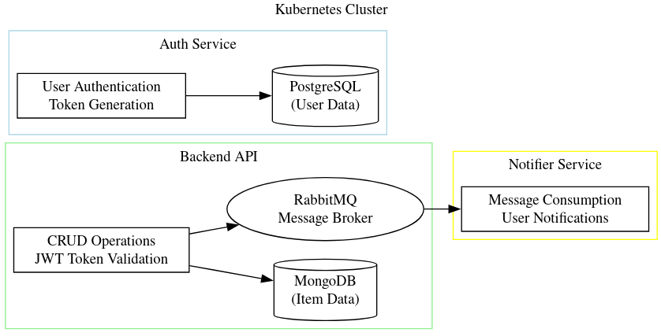

It has been 2–3 months since I'm involved in a personal project called little-ecom. It's a small ecommerce API that I've built. It's capable of registering a user, buy a product, send emails, make CRUD operations on items and other basic functionalities. Its microservices-based, and it has 3 main services: backend, auth, notifier. But it has several other deployments and statefulsets needed to work like rabbitmq, mongodb and an efk stack. I want to explain here some of the process I've been through to build this project.

I want to explain in this post some of the process I've been through to build this project. I'll not go into details of how to build each service, but I'll talk about the problems I faced and how I solved them. If you want to see the code, it's available on github:
https://github.com/cassiozareck/little-ecom/tree/main
### General architecture



### Backend service 
I started by building the backend service using Go. This backend service would be responsible to make crud operations on items (products). I'd chosen to use mongoDB because it's a NoSQL database, and I wanted to learn more about it. I wrote some Go code using mux and http library, deployed on Docker Hub, built the k8s manifest with 2 replicas and deployed it on my minikube cluster. But I was having nightmares to set up my mongo service. This is because mongo replicas cant be run over a deployment.

### Mongo, StatefulSets and Helm charts 
If you want to run your database with replicas and thus, data replication, you will need to store some state between its replicas. For example, in a mongo setup, you will need to store the data of each replica, so if one of them goes down, the other one can still serve the data. Also, you may want to store some metadata like the replica configuration. This is not feasible with a deployment because a deployment is a set of pods that can be scaled up and down, and if you scale down a pod, you will lose its data. So, you need to use a statefulset.

Everything was ok if it wasn't the problem that when we work with multiple Mongo replicas, we need to configure them to know each other. Usually I had to join inside the running service and run some mongo commands to configure it. But if I had to reset the cluster by some reason, I would need to do the entire process again. Remembering each command and config.

This is a common behavior, but since it wasn't being sustainable for me I started to learn about helms and instead of building the k8s manifest and configure mongo by myself I used an out-of-the-box bitnami mongo helm chart which automatizes this process. Helms charts are very powerful in the sense they abstract the complexity of configuring a service and make it easy to deploy, letting you overwrite a small set of common configurations.

### RabbitMQ and Notifier service
I've also written a notifier service that'll send emails whenever new items are added into the application, but this implies a backend-notifier communication that needs to happen even with instability or be enqueued for notifier to read. So, I've deployed a RabbitMQ instance on the cluster and used a custom exchange to add messages in a queue where notifier would be a consumer.

It had a couple of queues where I described in GitHub project's repo:

```
Queues

    ecom-queue-item-added: This queue receives messages when a new item is added to the e-commerce platform. The notifier service listens to this queue and sends an email to the user, informing them about the new item.
    ecom-queue-item-bought: This queue receives messages when an item is purchased. The notifier service listens to this queue and sends a confirmation email to the buyer.

```

### Ingress and reverse proxy
Since little-ecom has 2 main services supposed to be accessible (backend and auth). I needed to expose them to the outside world. I've used an ingress controller to do this. An ingress controller is a reverse proxy that will redirect requests to the correct service. In my case, I defined 2 http rules: if it starts with /auth goes to auth service, in case where it doesn't then should be redirected to the backend service. I've used nginx ingress controller, but there's also traefik and others.

Oh, I had a big problem with it. Since I was using swagger to test my endpoints defined in an OpenAPI file, I had problems with CORS. Since swaggers were running on my browser, it asked for CORS permission to the backend service, but since it was running on a different domain, it was blocked. I've solved this by adding a CORS middleware on the backend service, it wasn't enough, so I also had to write a specification in the ingress controller to allow CORS. This gave me a lot of headaches.

### Authentication service
Little-ecom also has an authentication service to safely register users using bcrypt with salts to store passwords. It also have an endpoint for SignIn and validate jwt tokens. I want to explain more in another post about tokens, sessions and how to safely store passwords. 

### Cluster network 
I was having a lot of problems with DNS configuration, service communication and discovery. So I started to learn more about k8s network and dedicated a lot of my time on it. But first, we should talk about how containers network works (in theory, we should start by how the internet and normal network works, but I'm considering you read [my network's post](2023-11-19-network-and-internet.md)). 

#### Docker network and how it works
Docker has 4 main types of network: bridge, host, none and macvlan. In bridge mode, docker creates a virtual interface (remember layer 2?) and a virtual network (layer 3) where all containers are attached to. This means all containers can communicate with each other using this virtual network, and you can communicate with the outside world since it uses NAT. Generally, docker0 is the interface behind it.
Now, with host mode it doesn't do NAT, instead, it shares a network namespace with the host. Network namespace is another useful resource linux has. Macvlan is one level above and uses your routers dhcp server to work like a real device on your local network. None is just a container without a network.

#### K8s network
K8s network is more abstract. We all learn that every pod has an IP but you should use deploy to work with a service that will define a unique IP to a set of pods. That a NodePort is a type of service that will expose a port to the outside world. ad LoadBalancer is a service that will expose a port to the outside world and redirect to the correct service. But how does this work? Let's suppose a pod wants to communicate with a pod that is on a different node.

I guess you remember about kubelets being an agent that runs on every node. This kubelet creates iptables rules (another cool linux feature), so when a request goes out some pod through a veth pairs (interfaces), it knows where to redirect by only looking at it, even if a pod is behind a service and a different node this rules can map to a real IP and its node IP associated. I like to think about it as etc/resolv.d linux file works, but of course this only maps for DNS

It wasn't like this since kubernetes was born. In the beginning, I read that requests were first sent to a centralized service that knew where to forward, but this was too slow and not scalable. So, they started to use iptables rules to solve this problem.

### Integration tests
I've written automated tests using python and requests lib to ensure my cluster and its communication flow was working correctly. It works by making API calls, storing tokens, testing invalid token, invalid credentials, buying an item, adding an item, etc. It was very useful to ensure my cluster was working correctly.

### EFK Stack 
I was wanting to visualize each and every log to have control of everything on the cluster, so I had to rack one's brains setting up an elastic-search, fluentd and kibana stack. I did it, but I'll be honest that I haven't used it, it doesn't help that much if you doesnt have a lot of logs to visualize and know how to configure filters. But it was a good experience to learn more about logging and how to configure it.  

### About this project
As always, these projects take way more time than we thought. But it's a rewarding experience that I wouldn't get with any tutorial or course. Some of the key things I develop in this process:
- K8s and different components: statefulsets, deployments, nodes, configmaps... 
- Rabbbitmq: communication between 2 services intermediate by a queue
- Hands-on experience with ingress and reverse-proxies
- How to model software into small services
- Routings and network through a distributed system
- Evetual consistency with nosql database
- Cluster managament: pods scheduling, solving dns problems, scaling nodes...
- Auth: securely storing passwords, jwt tokens, refresh tokens, middlewares...
- Helm charts: how to use it, how to build it, how to configure it
- Logging: how to configure it, how to visualize it
- How to create automated tests for a distributed system

One of the reasons I started this project was because since last year I was used to work with docker and docker-compose. Thus, I was wanting to expand my skills into microservice's world, so I started to build an ecommerce. The best way to learn is by practice. If you face the problems by yourself, you'll develop a stronger skill in this subject. I hope I can continue this project and learn more about it. Have a good day!

